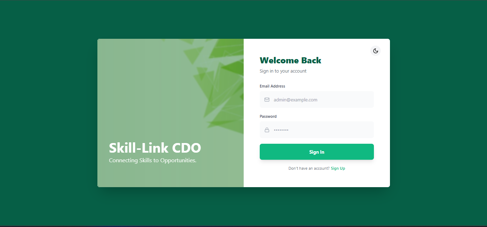
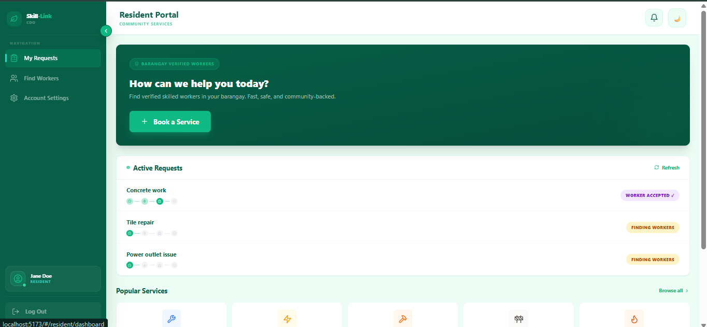
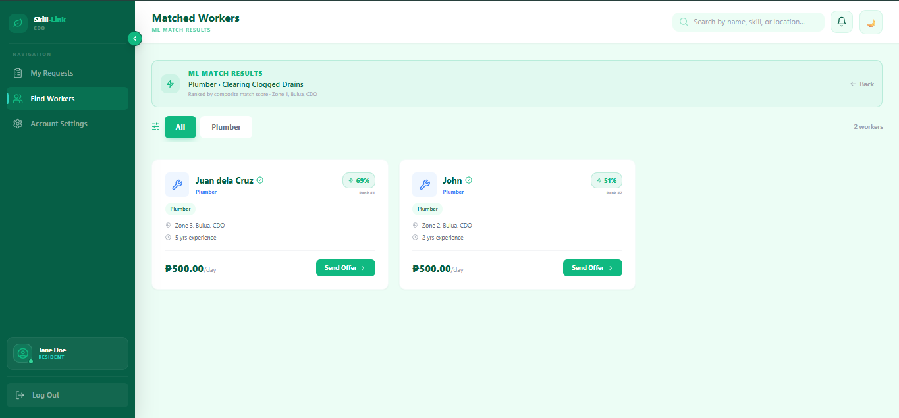
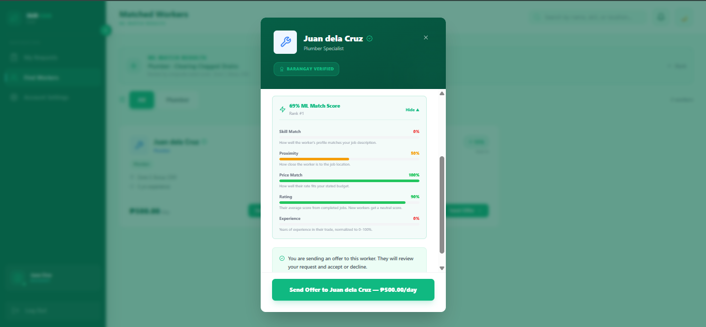
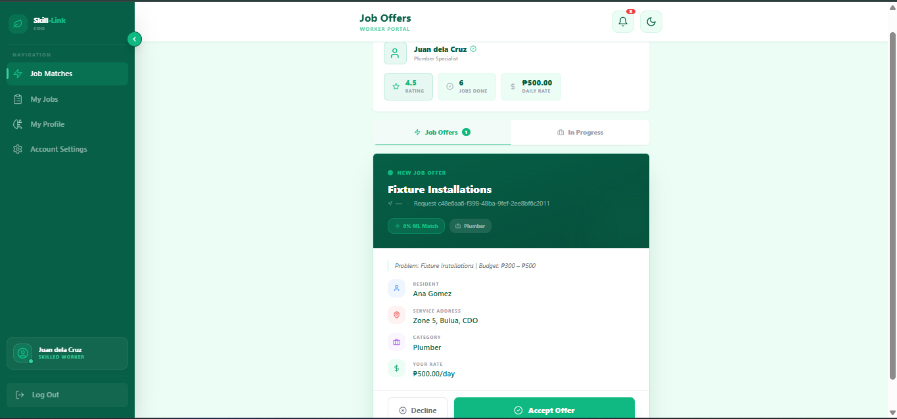
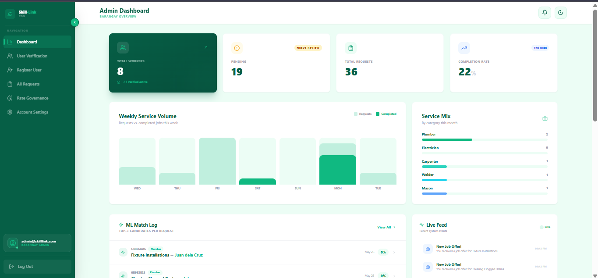

# Skill-Link CDO — Web Application

## Project Description

Skill-Link CDO is a machine learning-assisted, barangay-based skilled worker registry and matching system for Cagayan de Oro City, Philippines. The web application serves as the primary interface for Barangay Administrators and an alternative interface for Skilled Workers and Residents. It connects residents with verified skilled workers through an ML-powered matching engine that ranks candidates by skill relevance, geographic proximity, price compatibility, and average rating.

---

## Features

### Resident Portal

- Submit job requests by selecting a skill category tile, a specific job type, a budget range, and a job location (auto-filled from registered address)
- Receive a ranked list of ML-matched verified workers immediately after submission
- Browse matched workers with composite match scores, score breakdowns, and distance information
- Send job offers to selected workers and track offer status in real time
- View active and past job requests with a live status stepper
- Submit ratings for completed jobs

### Skilled Worker Portal

- Register a profile with skill category, declared rate, years of experience, and a bio
- Upload TESDA certificates and barangay clearances for admin verification
- Toggle online/offline availability
- View and respond to incoming job offers (accept or decline)
- Track active jobs and mark jobs as complete
- View job history with earnings and rating summaries

### Barangay Administrator Dashboard

- Verify or reject worker and resident profiles
- Register walk-in workers and residents directly from the dashboard
- Define and update rate bands per skill category
- Manage skill categories and job type tiles
- View aggregated analytics: total workers, job request volume, completion rates, top-rated workers
- View ML match logs and system activity feed
- Manage audit logs for RA 10173 compliance

---

## Technology Stack

| Layer              | Technology                                            |
| ------------------ | ----------------------------------------------------- |
| Frontend Framework | React 18 + Vite                                       |
| Styling            | TailwindCSS                                           |
| Routing            | React Router v6                                       |
| HTTP Client        | Fetch API (custom wrapper in `src/services/api.js`)   |
| Authentication     | JWT Bearer tokens via Django REST Framework SimpleJWT |
| State Management   | React `useState` / `useEffect` / `useCallback`        |
| Icons              | Lucide React                                          |
| Build Tool         | Vite                                                  |
| Deployment         | Vercel                                                |

---

## System Architecture

The web application is the presentation layer of a multi-tier, service-oriented system.

```
[React Web App — Vercel]
        │  HTTPS + JWT
        ▼
[Django REST API — Render]
        │  HTTP POST + X-Service-Key
        ▼
[FastAPI ML Service — Render]   ←→   [PostgreSQL — Render]
        │                                     │
        ▼                                     ▼
[Supabase Storage]                   [Notification Store]
```

- The web app communicates exclusively with the Django REST API over HTTPS using JWT bearer tokens.
- The Django API handles all business logic, database access, and ML service orchestration.
- The ML matching engine is a separate FastAPI microservice — the frontend never calls it directly.

---

## Installation & Setup

### Prerequisites

- Node.js 18+
- npm or yarn
- The Django backend (`Skill-Link-Cdo-Backend`) must be running locally or deployed

### Steps

```bash
# 1. Clone the repository
git clone https://github.com/Quenie-Ann/skill-link-cdo.git
cd skill-link-cdo

# 2. Install dependencies
npm install

# 3. Configure environment variables
cp .env.example .env
# Edit .env and set:
# VITE_API_URL=http://127.0.0.1:8000/api

# 4. Start the development server
npm run dev
```

The app will be available at `http://localhost:5173`.

### Environment Variables

| Variable       | Description                     | Example                     |
| -------------- | ------------------------------- | --------------------------- |
| `VITE_API_URL` | Base URL of the Django REST API | `http://127.0.0.1:8000/api` |

---

## Deployment Link

**Live Web App:** `https://skill-link-cdo.vercel.app`

---

## Test Accounts

| Role           | Email                    | Password      |
Localhost 
| -------------- | ------------------------ | ------------- |
| Barangay Admin | `admin@skilllink.com`    | `admin123`    |
| Skilled Worker | `worker@skilllink.com`   | `worker123`   |
| Resident       | `resident@skilllink.com` | `resident123` |
Deployed Vercel 
| Barangay Admin | `admin@skilllinkcdo.com`    | `SkillLink2026!`    |
| Skilled Worker | `worker.bernard.lim.electrician@skilllinkcdo.com`   | `SkillLink2026!`   |
| Resident       | `resident.maria.santos.1@skilllinkcdo.com` | `SkillLink2026!` |

---

## Team Members and Roles

| Name                     | Role                                                              |
| ------------------------ | ----------------------------------------------------------------- |
| [Abragan, Quenie Ann H.] | Full-Stack Developer / Project Lead / ML Engineer / Documentation |
| [Tubio, Johnlie P.]      | Full-Stack Developer                                              |
| [Gaccion, Tirso Louise]  | Full-Stack Developer                                              |

---

## Known Limitations

- **Notification delivery is polling-based.** The notification bell queries the API every time the page gains focus and at a fixed interval. Real-time push via WebSocket or Server-Sent Events is a planned post-pilot enhancement.
- **Geolocation precision.** The browser geolocation API uses WiFi/IP triangulation (`enableHighAccuracy: false`) rather than GPS, providing accuracy within approximately 50–200 metres — sufficient for barangay-level proximity scoring but not for precise street-level matching.
- **Mock data toggle.** `USE_MOCK` in `src/services/api.js` must be set to `false` for live backend operation. It defaults to `false` in this repository but can be switched to `true` for offline UI development.
- **Free-tier cold starts.** The Render-hosted backend services may hibernate after a period of inactivity, causing the first request after a cold start to take up to 30 seconds.

---

## Screenshots

> 
> 
> 
> 
> 
